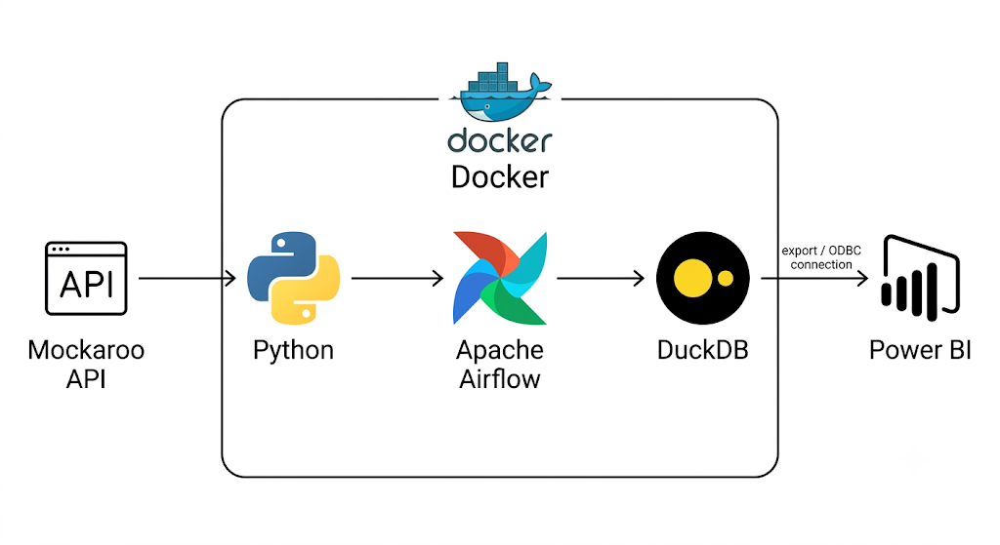

# Sales Data ETL Pipeline — Mockaroo to DuckDB Data Warehouse

## 🎯 Project Goal

This project implements an automated **ETL (Extract, Transform, Load)** pipeline that extracts e-commerce sales data from the [Mockaroo](https://www.mockaroo.com/) API, processes it through multiple data quality layers, and loads it into a **Data Warehouse (DWH)** built on **DuckDB**, ready for analysis and reporting (including BI tools such as Power BI).

The pipeline is orchestrated with **Apache Airflow**, and the entire environment runs in **Docker** containers, ensuring reproducible and automated execution (daily scheduling).

---

## 🖼️ Architecture Diagram



Data flows from the Mockaroo API into a Python-based extraction step, orchestrated by Apache Airflow, all running inside Docker. The processed data lands in the DuckDB data warehouse, which is then queried or exported (via ODBC connection or file export) for visualization in Power BI, running outside the Docker environment.

---

## 🏗️ Data Warehouse Architecture

The Data Warehouse follows a **medallion architecture (bronze / silver / gold)**, organized into three layers (DuckDB schemas) inside a single database file: `ecommerce_data.duckdb`.

```
Mockaroo API (CSV)
        │
        ▼
┌─────────────────┐
│   RAW LAYER      │  ← Raw data, exactly as received from the API
│  raw_layer.sales │     (append-only, no transformation)
└─────────────────┘
        │
        ▼
┌──────────────────────┐
│   REFINED LAYER        │  ← Cleaned and enriched data
│  refined_layer.sales   │     (business logic, validation, deduplication)
└──────────────────────┘
        │
        ▼
┌─────────────────────────────────┐
│   REPORT LAYER                   │  ← Aggregated data, ready for analysis
│  report_layer.sales_by_country   │
│  report_layer.sales_by_product   │
│  report_layer.sales_by_payment_method │
└─────────────────────────────────┘
```

### 1. Raw Layer (`raw_layer.sales`)
Stores **raw** data exactly as received from the Mockaroo API, with no transformation applied. Append-only — every ingestion adds new rows without deleting history. Each row is timestamped via an `ingestion_timestamp` column (`DEFAULT current_timestamp`) to track when it was ingested.

### 2. Refined Layer (`refined_layer.sales`)
Applies business logic on top of the raw data:
- Computes `total_amount` (`quantity * unit_price`)
- Validates transactions (`is_valid_transaction`) based on business rules: positive quantity, positive unit price, order status not `cancelled`/`refunded`, and a non-empty email
- Deduplicates by `order_id` (`PRIMARY KEY`) — only rows whose `order_id` is not already present are inserted, making the transformation **idempotent** (safe to re-run without creating duplicates)

### 3. Report Layer (aggregations)
Three reporting tables computed from the `refined_layer`, aggregated by dimension, using only valid transactions (`is_valid_transaction = TRUE`):
- **`sales_by_country`**: total revenue, order count, average order value per country
- **`sales_by_product`**: total revenue, order count, average order value per product
- **`sales_by_payment_method`**: total revenue, order count, average order value per payment method

Each report table carries a `report_date` column (`DEFAULT current_date`). On every run, that day's rows are deleted and recomputed before inserting — so re-running the DAG on the same day refreshes the numbers instead of duplicating them.

---

## ⚙️ Airflow DAG — `load_sales_data_to_db`

### Main goal of the DAG

The DAG's job is to move sales data through the full medallion pipeline **once a day, automatically, and safely** — meaning it can be re-run (manually or after a retry) without corrupting the data or creating duplicates. It ties together the extraction from an external API, the loading into the warehouse, the business-rule transformation, and the reporting aggregation into a single, ordered, monitorable workflow.

### Task flow

```
fetch_sales_data >> store_sales_data_to_db >> transform_to_refined >> generate_reports
```

Each task only starts once the previous one has completed successfully — this ordering (`>>`) is what guarantees, for example, that `transform_to_refined` never reads from `raw_layer.sales` before that day's rows have actually been inserted.

| Task                       | Role                                                                                   |
|-----------------------------|-----------------------------------------------------------------------------------------|
| `fetch_sales_data`          | Calls the Mockaroo API, parses the CSV response into records, and pushes them to XCom  |
| `store_sales_data_to_db`    | Pulls the records from XCom and inserts them into `raw_layer.sales`                    |
| `transform_to_refined`      | Cleans, validates, and enriches raw rows into `refined_layer.sales` (idempotent)       |
| `generate_reports`          | Aggregates validated rows into the three `report_layer.*` tables (refreshed daily)     |

### Why `PythonOperator`

Every task uses Airflow's `PythonOperator`, which runs a plain Python function (`python_callable`) as the task body. This was chosen because:
- DuckDB has no dedicated native Airflow operator (unlike Postgres or MySQL)
- The pipeline needs custom logic — HTTP calls, CSV parsing, XCom handoff, error handling — that a generic SQL-only operator couldn't express

### Error handling and retries

- Each task function wraps its logic in `try/except/finally`, logs the error, and **re-raises it** (`raise`). This is essential: if an exception is logged but not re-raised, Airflow considers the task successful even though it actually failed — silently leaving the database in an inconsistent state.
- `default_args` configures `retries: 2` and `retry_delay: 2 minutes` — so a transient failure (e.g. a temporary API timeout) is retried automatically before the task is marked as failed.

### Scheduling

- **Schedule**: `@daily` (equivalent to `0 0 * * *`) — runs once every day at midnight **UTC**. The Airflow UI displays this converted to the local timezone, so it may appear as a different hour depending on your region.
- **`catchup=False`**: prevents Airflow from backfilling runs for every day between `start_date` and today when the DAG is first activated — only future scheduled runs (and manually triggered ones) will execute.

### Idempotency, end to end

A key design goal of this DAG is that **triggering it multiple times on the same day should not corrupt or duplicate data**:
- `raw_layer.sales` is append-only by design (each ingestion is a new batch, tracked by `ingestion_timestamp`)
- `transform_to_refined` only inserts `order_id`s not already present in `refined_layer.sales`
- `generate_reports` deletes and recomputes only the current day's report rows before inserting

---

## 📦 Requirements

### Required software
- [Docker](https://www.docker.com/) and Docker Compose
- Python 3.9+ (for local execution outside the container, if needed)
- A [Mockaroo](https://www.mockaroo.com/) account with a valid API key

### Python dependencies (installed in the Airflow container)
```
apache-airflow
duckdb
pandas
requests
```

### Docker services
The project relies on the following services (defined in `docker-compose.yml`):
- `airflow-webserver` — Airflow user interface
- `airflow-scheduler` — task scheduler
- `airflow-worker` — task executor (Celery)
- `postgres` — Airflow metadata database
- `redis` — Celery broker

---

## 🔧 Configuration

### Variables to set
In the DAG file (`sales.py`), configure:

```python
API_URL = "https://my.api.mockaroo.com/sales_data"
API_KEY = "<YOUR_MOCKAROO_API_KEY>"
DUCKDB_PATH = "/opt/airflow/db/ecommerce_data.duckdb"
```

> ⚠️ **Best practice**: the API key should not be hardcoded in the script. Consider using [Airflow Variables](https://airflow.apache.org/docs/apache-airflow/stable/core-concepts/variables.html) or [Connections](https://airflow.apache.org/docs/apache-airflow/stable/core-concepts/connections.html) to store it securely.

### Docker volume
For the DuckDB file to be accessible from the host (e.g. to inspect it with DBeaver or export it for Power BI), make sure the `db/` folder is mounted as a shared volume in `docker-compose.yml`:

```yaml
volumes:
  - ./db:/opt/airflow/db
```

⚠️ **Important**: `init_db_schema.py` must connect using the exact same path as the DAG (`DUCKDB_PATH = "/opt/airflow/db/ecommerce_data.duckdb"`), not a relative path — otherwise the schema gets created in a different file than the one the DAG writes to.

---

## 🚀 Quick Start

```bash
# Start the Airflow environment
docker compose up -d

# Check that containers are running
docker ps

# Initialize the DuckDB schema (raw / refined / report)
docker exec -it airflow-airflow-worker-1 python3 /opt/airflow/db/init_db_schema.py

# Access the Airflow UI
# http://localhost:8080

# Activate the DAG in the UI, then trigger it manually (or wait for the daily schedule)
docker exec -it airflow-airflow-worker-1 airflow dags trigger load_sales_data_to_db
```

---

## 🔍 Checking the Data

### From inside the Airflow container (Python)
```bash
docker exec -it airflow-airflow-worker-1 python3
```
```python
import duckdb
conn = duckdb.connect("/opt/airflow/db/ecommerce_data.duckdb")
conn.sql("SHOW ALL TABLES").show()
conn.sql("SELECT * FROM raw_layer.sales ORDER BY ingestion_timestamp DESC LIMIT 10").show()
conn.sql("SELECT * FROM refined_layer.sales LIMIT 10").show()
conn.sql("SELECT * FROM report_layer.sales_by_country").show()
```

### From DBeaver (host machine)
1. Copy or mount the `.duckdb` file from the container
2. Create a new DuckDB connection in DBeaver, pointing to the file
3. Explore the `raw_layer`, `refined_layer`, and `report_layer` schemas

### From Power BI
DuckDB has no native Power BI connector yet. Two practical options:
- **ODBC**: install the DuckDB ODBC driver, configure a DSN pointing to `ecommerce_data.duckdb`, then connect via **Get Data → ODBC** in Power BI
- **File export**: export report tables to Parquet/CSV (e.g. via `COPY report_layer.sales_by_country TO 'sales_by_country.parquet' (FORMAT PARQUET)`) and load them in Power BI via **Get Data → Parquet/Text-CSV**

---

## 📁 Project Structure

```
.
├── dags/
│   └── raw/
│       └── sales.py          # Main Airflow DAG (fetch → raw → refined → report)
├── db/
│   ├── init_db_schema.py     # DuckDB schema initialization script
│   └── ecommerce_data.duckdb # DuckDB database file (generated)
├── docker-compose.yml        # Docker services definition
├── requirements.txt          # Python dependencies
└── README.md                 # This file
```

---

## 🗺️ Possible Future Improvements

- Secure the Mockaroo API key via Airflow Connections/Variables instead of hardcoding it
- Move large data transport from XCom to intermediate storage (file/S3) for better scalability, since XCom is not designed for large payloads
- Add data quality checks (e.g. Great Expectations) between the raw → refined layers
- Add a `data_quality_check` task before loading into `refined_layer`
- Add a dedicated `export_to_powerbi` task that writes Parquet files for BI consumption on each run
- Consider historizing `report_layer` (instead of daily overwrite) if trend analysis over time becomes a requirement
