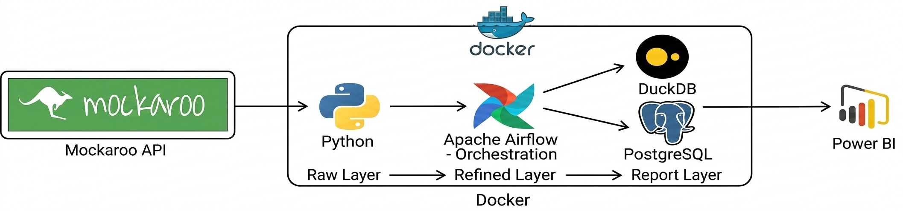
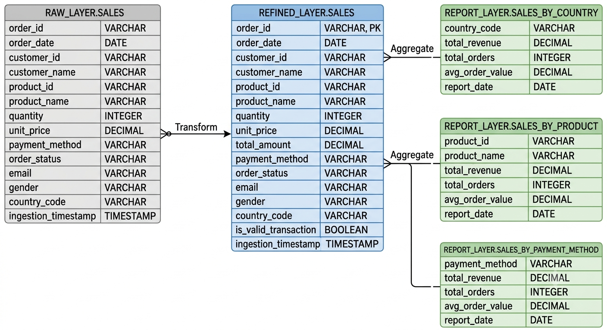
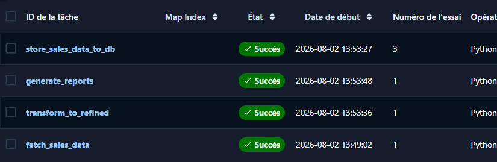

# Sales Data ETL Pipeline — Mockaroo to a Dual DuckDB / PostgreSQL Data Warehouse

## 🎯 Project Goal

This project implements an automated **ETL (Extract, Transform, Load)** pipeline that extracts e-commerce sales data from the [Mockaroo](https://www.mockaroo.com/) API, processes it through multiple data quality layers, and loads it into **two Data Warehouse backends in parallel**: **DuckDB** (local file, lightweight, ideal for fast local analysis) and **PostgreSQL** (a dedicated server, better suited for concurrent access and BI tool integration).

The pipeline is orchestrated with **Apache Airflow**, and the entire environment runs in **Docker** containers, ensuring reproducible and automated execution (daily scheduling). The resulting warehouse data is queryable directly, or exportable/connectable to **Power BI** for visualization.

---

## 🖼️ Architecture Diagram



Data flows from the Mockaroo API into a Python-based extraction step, orchestrated by Apache Airflow, all running inside Docker. Within the medallion pipeline (Raw Layer → Refined Layer → Report Layer), Airflow writes the processed data to **both** DuckDB and PostgreSQL in parallel — the same schema is maintained on each backend. Power BI, running outside the Docker environment, connects to either warehouse (via file export/ODBC for DuckDB, or a direct database connection for PostgreSQL).

---

## 🏗️ Data Warehouse Architecture

The Data Warehouse follows a **medallion architecture (bronze / silver / gold)**, organized into three layers (schemas), maintained identically on **both** storage backends:


- **DuckDB**: a single local file, `ecommerce_data.duckdb`, mounted into the Airflow containers via a Docker volume.
- **PostgreSQL**: a dedicated `warehouse-db` container (separate from the PostgreSQL instance used internally for Airflow's own metadata).

```
Mockaroo API (CSV)
        │
        ▼
┌─────────────────┐
│   RAW LAYER      │  ← Raw data, exactly as received from the API
│  raw_layer.sales │     (append-only, no transformation)
└─────────────────┘
        │
        ▼
┌──────────────────────┐
│   REFINED LAYER        │  ← Cleaned and enriched data
│  refined_layer.sales   │     (business logic, validation, deduplication)
└──────────────────────┘
        │
        ▼
┌─────────────────────────────────┐
│   REPORT LAYER                   │  ← Aggregated data, ready for analysis
│  report_layer.sales_by_country   │
│  report_layer.sales_by_product   │
│  report_layer.sales_by_payment_method │
└─────────────────────────────────┘
```

Every layer above is written **twice per DAG run** — once to DuckDB, once to PostgreSQL — using the exact same business logic, so the two warehouses stay consistent with each other.

### 1. Raw Layer (`raw_layer.sales`)
Stores **raw** data exactly as received from the Mockaroo API, with no transformation applied. Append-only — every ingestion adds new rows without deleting history. Each row is timestamped via an `ingestion_timestamp` column (`DEFAULT current_timestamp`) to track when it was ingested.

### 2. Refined Layer (`refined_layer.sales`)
Applies business logic on top of the raw data:
- Computes `total_amount` (`quantity * unit_price`)
- Validates transactions (`is_valid_transaction`) based on business rules: positive quantity, positive unit price, order status not `cancelled`/`refunded`, and a non-empty email
- Deduplicates by `order_id` (`PRIMARY KEY`) — only rows whose `order_id` is not already present are inserted, making the transformation **idempotent** (safe to re-run without creating duplicates). On PostgreSQL, this is additionally protected with `ON CONFLICT (order_id) DO NOTHING`.

### 3. Report Layer (aggregations)
Three reporting tables computed from the `refined_layer`, aggregated by dimension, using only valid transactions (`is_valid_transaction = TRUE`):
- **`sales_by_country`**: total revenue, order count, average order value per country
- **`sales_by_product`**: total revenue, order count, average order value per product
- **`sales_by_payment_method`**: total revenue, order count, average order value per payment method

Each report table carries a `report_date` column (`DEFAULT current_date`). On every run, that day's rows are deleted and recomputed before inserting — so re-running the DAG on the same day refreshes the numbers instead of duplicating them.

---

## 🗂️ Entity-Relationship Diagram (ERD)



`raw_layer.sales` is transformed into `refined_layer.sales` (business rules applied, deduplicated by `order_id`), which is then aggregated into the three `report_layer` tables — one per dimension (country, product, payment method). Each box above shows the exact columns and data types used on both the DuckDB and PostgreSQL backends.

---

## ⚙️ Airflow DAG — `load_sales_data_to_db`

### Main goal of the DAG

The DAG's job is to move sales data through the full medallion pipeline **once a day, automatically, and safely**, writing to both storage backends — meaning it can be re-run (manually or after a retry) without corrupting the data or creating duplicates, on either DuckDB or PostgreSQL. It ties together the extraction from an external API, the dual-backend loading, the business-rule transformation, and the reporting aggregation into a single, ordered, monitorable workflow.

### Task flow

```
fetch_sales_data >> store_sales_data_to_db >> transform_to_refined >> generate_reports
```

Each task only starts once the previous one has completed successfully — this ordering (`>>`) is what guarantees, for example, that `transform_to_refined` never reads from `raw_layer.sales` before that day's rows have actually been inserted into both backends.

| Task                       | Role                                                                                                       |
|-----------------------------|-------------------------------------------------------------------------------------------------------------|
| `fetch_sales_data`          | Calls the Mockaroo API, parses the CSV response into records, and pushes them to XCom                     |
| `store_sales_data_to_db`    | Pulls the records from XCom and inserts them into `raw_layer.sales` on **both** DuckDB and PostgreSQL      |
| `transform_to_refined`      | Cleans, validates, and enriches raw rows into `refined_layer.sales` on **both** backends (idempotent)       |
| `generate_reports`          | Aggregates validated rows into the three `report_layer.*` tables on **both** backends (refreshed daily)    |

Within each task, the DuckDB write and the PostgreSQL write are two independent operations, each wrapped in its own `try/except/finally` block — so a failure on one backend doesn't silently mask a failure on the other, and Airflow retries the whole task if either one fails.

### ✅ Example of a successful run



All four tasks completed successfully, in the expected order (`fetch_sales_data` → `store_sales_data_to_db` → `transform_to_refined` → `generate_reports`), confirming that both the DuckDB and PostgreSQL writes went through at every layer for this run.

### Why `PythonOperator`

Every task uses Airflow's `PythonOperator`, which runs a plain Python function (`python_callable`) as the task body. This was chosen because:
- Writing to two different database engines in the same task requires custom Python logic that no single generic SQL operator could express
- The pipeline also needs HTTP calls, CSV parsing, and XCom handoff, on top of the dual-database writes

### Error handling and retries

- Each backend-specific block wraps its logic in `try/except/finally`, logs the error, and **re-raises it** (`raise`). This is essential: if an exception is logged but not re-raised, Airflow considers the task successful even though it actually failed — silently leaving one or both databases in an inconsistent state.
- `default_args` configures `retries: 2` and `retry_delay: 2 minutes` — so a transient failure (e.g. a temporary API timeout, or PostgreSQL not yet ready) is retried automatically before the task is marked as failed.

### Scheduling

- **Schedule**: `@daily` (equivalent to `0 0 * * *`) — runs once every day at midnight **UTC**. The Airflow UI displays this converted to the local timezone, so it may appear as a different hour depending on your region.
- **`catchup=False`**: prevents Airflow from backfilling runs for every day between `start_date` and today when the DAG is first activated — only future scheduled runs (and manually triggered ones) will execute.

### Idempotency, end to end, on both backends

A key design goal of this DAG is that **triggering it multiple times on the same day should not corrupt or duplicate data, on either DuckDB or PostgreSQL**:
- `raw_layer.sales` is append-only by design (each ingestion is a new batch, tracked by `ingestion_timestamp`)
- `transform_to_refined` only inserts `order_id`s not already present in `refined_layer.sales` (with an extra `ON CONFLICT` safeguard on PostgreSQL)
- `generate_reports` deletes and recomputes only the current day's report rows before inserting

### ⚠️ Not transactional across backends

The DuckDB write and the PostgreSQL write in a given task are **independent** — if DuckDB succeeds but PostgreSQL fails (or vice versa), the task fails and Airflow retries the entire task on the next attempt. Since every layer is idempotent, a retry safely catches up the backend that fell behind, without duplicating anything on the one that already succeeded.

---

## 📦 Requirements

### Required software
- [Docker](https://www.docker.com/) and Docker Compose
- Python 3.9+ (for local execution outside the container, if needed)
- A [Mockaroo](https://www.mockaroo.com/) account with a valid API key
- [pgAdmin](https://www.pgadmin.org/) or [DBeaver](https://dbeaver.io/) (recommended, for browsing the warehouses)

### Python dependencies (installed in the Airflow image, on top of the base `apache/airflow` image)
```
duckdb
psycopg2-binary
sqlalchemy
pandas
requests
pyarrow
```

### Docker services
The project relies on the following services (defined in `docker-compose.yaml`):
- `airflow-apiserver` / `airflow-scheduler` / `airflow-dag-processor` / `airflow-worker` / `airflow-triggerer` — Airflow components
- `postgres` — Airflow's own internal metadata database (separate from the data warehouse)
- `warehouse-db` — dedicated **PostgreSQL data warehouse**, exposed on host port `5433`
- `redis` — Celery broker

DuckDB has no separate service — it's a single file (`ecommerce_data.duckdb`) inside the shared `db/` volume, mounted into every Airflow container.

---

## ⚖️ DuckDB vs PostgreSQL — why both?

This project deliberately writes to both backends, since they serve different purposes:

| | **DuckDB** | **PostgreSQL** |
|---|---|---|
| **Architecture** | Embedded (in-process) — no server needed | Client-server — runs as a separate service |
| **Deployment** | A single portable file | A dedicated `warehouse-db` container |
| **Concurrency** | Single-writer at a time (not built for concurrent access) | Full multi-user, concurrent read/write support |
| **Best for** | Fast local analytics, ad-hoc queries, notebooks | BI tools, dashboards, multi-user/production access |
| **Setup** | Zero configuration — just a file path | Requires host, port, user, password |
| **Power BI** | No native connector (ODBC or file export needed) | Native PostgreSQL connector built into Power BI |
| **Use case here** | Quick local inspection (DBeaver, Python scripts) | Central warehouse for BI and shared access |

In short: **DuckDB** is used for lightweight, zero-setup local analysis, while **PostgreSQL** acts as the shared, production-style warehouse that other tools (like Power BI) connect to directly.

---

## 🔧 Configuration

### Environment variables
Connection details are read from environment variables, set in `docker-compose.yaml` (`x-airflow-common -> environment`) and in a local `.env` file (never committed to Git):

```env
# Mockaroo
MOCKAROO_API_KEY=<YOUR_MOCKAROO_API_KEY>

# PostgreSQL warehouse
WAREHOUSE_DB_HOST=warehouse-db
WAREHOUSE_DB_PORT=5432
WAREHOUSE_DB_NAME=ecommerce_data
WAREHOUSE_DB_USER=dwh_user
WAREHOUSE_DB_PASSWORD=*****

# DuckDB warehouse
DUCKDB_PATH=/opt/airflow/db/ecommerce_data.duckdb

# Airflow
AIRFLOW_UID=50000
FERNET_KEY=<generate with: python3 -c "from cryptography.fernet import Fernet; print(Fernet.generate_key().decode())">
```

> ⚠️ **Best practice**: never hardcode API keys or database passwords directly in `sales.py` or `init_db_schema.py` — both scripts already read these from environment variables, with safe fallback defaults for local development only.

### Docker volumes
```yaml
volumes:
  - ./db:/opt/airflow/db   # shares the DuckDB file with the host (for DBeaver, exports, etc.)
```

⚠️ **Important**: `init_db_schema.py` connects using the exact same `DUCKDB_PATH` / `WAREHOUSE_DB_*` values as the DAG — otherwise the schema gets created in a different location or database than the one the DAG actually writes to.

---

## 🚀 Quick Start

```bash
# Build the custom Airflow image (installs duckdb, psycopg2-binary, sqlalchemy, etc.)
docker compose build

# Start the full environment (Airflow + warehouse-db + redis + postgres)
docker compose up -d

# Check that all containers are running and healthy
docker ps

# Initialize the schema on BOTH DuckDB and PostgreSQL
docker exec -it airflow-airflow-worker-1 python3 /opt/airflow/db/init_db_schema.py

# Access the Airflow UI
# http://localhost:8080

# Activate the DAG in the UI, then trigger it manually (or wait for the daily schedule)
docker exec -it airflow-airflow-worker-1 airflow dags trigger load_sales_data_to_db
```

---

## 🔍 Checking the Data

### DuckDB — from inside the Airflow container
```bash
docker exec -it airflow-airflow-worker-1 python3
```
```python
import duckdb
conn = duckdb.connect("/opt/airflow/db/ecommerce_data.duckdb")
conn.sql("SHOW ALL TABLES").show()
conn.sql("SELECT * FROM raw_layer.sales ORDER BY ingestion_timestamp DESC LIMIT 10").show()
conn.sql("SELECT * FROM report_layer.sales_by_country").show()
```

### PostgreSQL — from pgAdmin or DBeaver (host machine)
Connect with:
- **Host**: `localhost`
- **Port**: `5433` (mapped from the container's internal `5432`, to avoid clashing with Airflow's own `postgres` service)
- **Database**: `ecommerce_data`
- **Username** / **Password**: as set in `.env`

Then browse `raw_layer`, `refined_layer`, and `report_layer`, or run the queries in `db/main.sql`.

### DuckDB — from DBeaver (host machine)
1. Copy or mount the `.duckdb` file from the container
2. Create a new DuckDB connection in DBeaver, pointing to the file
3. Explore the `raw_layer`, `refined_layer`, and `report_layer` schemas

### From Power BI
- **PostgreSQL**: use Power BI's built-in **Get Data → PostgreSQL database** connector, pointing to `localhost:5433` / `ecommerce_data`
- **DuckDB**: no native Power BI connector yet — either install the DuckDB ODBC driver and connect via **Get Data → ODBC**, or export report tables to Parquet/CSV and load them via **Get Data → Parquet/Text-CSV**

---

## 📁 Project Structure

```
.
├── dags/
│   └── raw/
│       └── sales.py            # Main Airflow DAG — writes to DuckDB AND PostgreSQL at every layer (raw, refined, report)
├── db/
│   ├── init_db_schema.py       # Creates the schema on BOTH DuckDB and PostgreSQL
│   ├── db_steup.log            # Log file for schema initialization runs
│   └── ecommerce_data.duckdb   # DuckDB database file (generated)
├── Dockerfile                  # Extends the official Airflow image with project dependencies
├── docker-compose.yaml         # Docker services: Airflow components, warehouse-db, postgres, redis
├── requirements.txt            # Python dependencies (duckdb, psycopg2-binary, sqlalchemy, ...)
├── .env                        # Local environment variables (NEVER committed to Git)
├── ER_diagram.png              # Entity-Relationship Diagram of the warehouse schema
├── successful_task.png         # Screenshot of a successful Airflow DAG run
└── README.md                   # Project overview
```

---